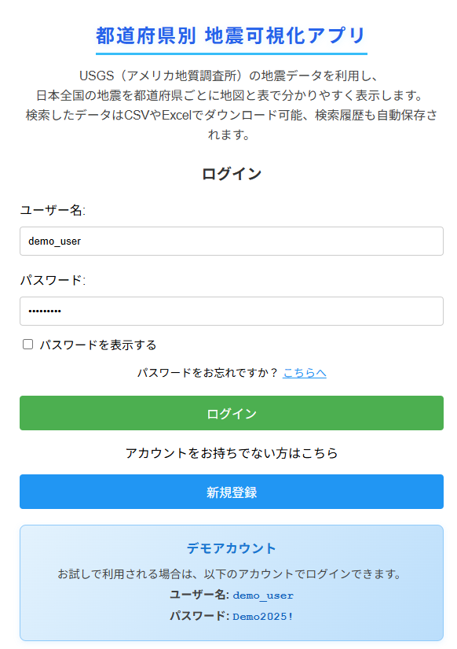
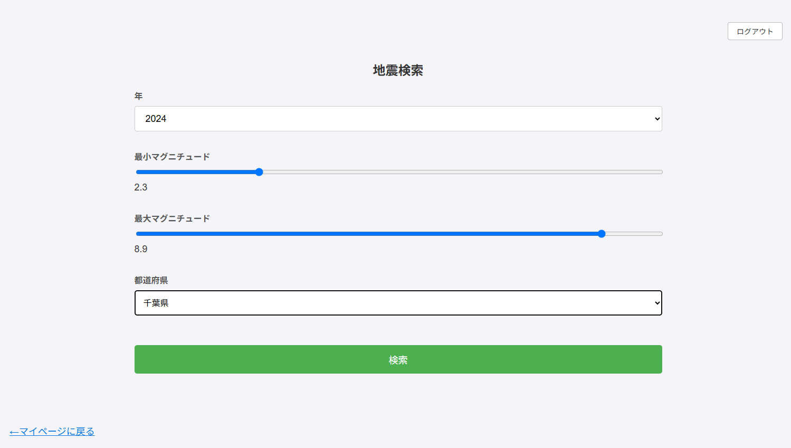
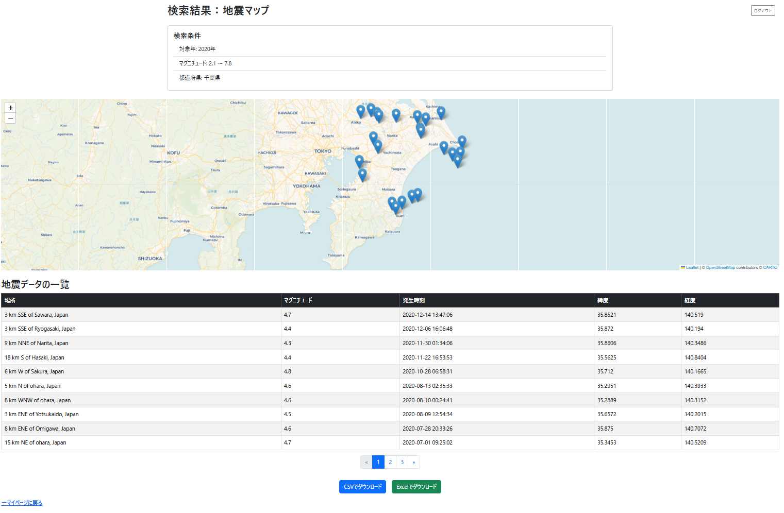
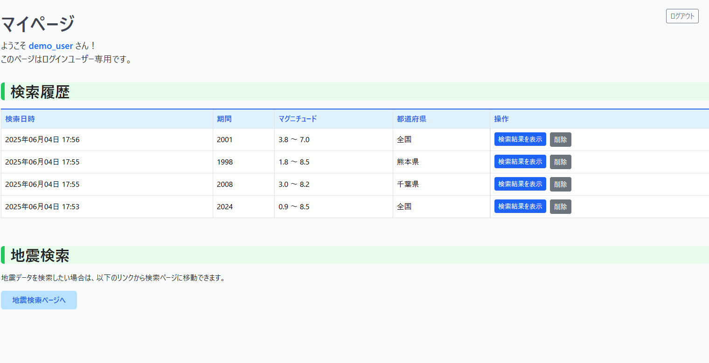

# 都道府県別　地震可視化アプリ

[](https://github.com/TechCat-Hello/quake_viz/actions/workflows/test.yml)

## プロジェクト概要
日本全国・都道府県別の地震データを検索・可視化できるDjango製Webアプリです。  
USGS Earthquake API（アメリカ地質調査所の地震データAPI）を利用し、  
ユーザー登録・検索履歴管理機能も搭載しています。  
マップ表示とCSV/Excel形式でのダウンロードが可能です。


## 特徴
- ユーザー登録 / ログイン / ログアウト
- 地震データを条件（年・地域・マグニチュード値）で検索
- 地図上へのプロット（Leaflet.js）
- 結果一覧のテーブル表示
- ページネーション対応
- CSV / Excelファイルでのデータ出力
- 過去の検索履歴表示・削除
- レスポンシブ対応（スマートフォンでも快適利用）
- USGS Earthquake APIから最新データ取得

## デプロイ先URL
https://quake-viz.onrender.com

## デモユーザーでのログイン方法

このアプリでは**新規登録機能は無効化されています**。

以下のデモユーザー情報を使用してログインしてください：

- **ユーザー名**: `demo_user`
- **パスワード**: `Demo2025!`

> ※ セキュリティ対策のため、閲覧権限はこのデモユーザーのみに限定されています。

## 使用技術
- Python / Django
- HTML / CSS / Bootstrap
- JavaScript / Leaflet.js / SheetJS
- SQLite3（デフォルトDB）
- Render（デプロイ）

## 画面イメージ
### ログイン画面

<br><br>
### 検索フォーム

<br><br>
### 検索結果（地図 + 表）

<br><br>
### マイページ（検索履歴）

<br><br>
## 開発環境
- Python 3.11.2
- Django 5.2
- Bootstrap 5
- requests

## 環境変数の設定
このアプリでは、秘密情報や接続設定を .env ファイルで管理しています。  
プロジェクトルートに .env ファイルを作成し、以下のように記述してください： 

```bash
DEBUG=True  # 本番では必ず False にしてください
SECRET_KEY=your-secret-key-here
ALLOWED_HOSTS=127.0.0.1,localhost
DATABASE_URL=sqlite:///db.sqlite3  # 開発用

# メール送信設定（本番環境で使用する場合）
EMAIL_BACKEND=django.core.mail.backends.smtp.EmailBackend
EMAIL_HOST=smtp.gmail.com
EMAIL_PORT=587
EMAIL_USE_TLS=True
EMAIL_HOST_USER=your_email@gmail.com
EMAIL_HOST_PASSWORD=your_app_password  # Gmailのアプリパスワードなど
DEFAULT_FROM_EMAIL=your_email@gmail.com
```
※ .env ファイルはセキュリティのため Git に含まれていません。  
必要に応じて .env.example を参考にしてください（同梱されています）。


## セットアップ方法
1.リポジトリをクローン
```bash
git clone https://github.com/TechCat-Hello/quake_viz.git
cd quake_viz
```

2.仮想環境を作成・有効化
```bash
python -m venv venv
source venv/bin/activate  # Windowsの場合: venv\Scripts\activate
```

3.依存パッケージをインストール
```bash
pip install -r requirements.txt
```

4.マイグレーション実行
```bash
python manage.py migrate
```

5.開発サーバー起動
```bash
python manage.py runserver
```

6.ブラウザでアクセス  
http://127.0.0.1:8000/ にアクセス  
  
## 工夫した点
- **リアルタイム性の重視**：地震データを自前のDBに保存せず、検索のたびにUSGS Earthquake APIから直接取得する設計にした。データの二重管理を避けつつ、常に最新の地震情報を表示できる。
- **セキュリティを考慮した公開範囲の制限**：ポートフォリオとして誰でもアクセスできる状態で公開するため、新規登録機能をあえて無効化し、閲覧用のデモアカウントのみでログインできるようにした。
- **依存パッケージの継続的なアップデート**：GitHubのDependabotセキュリティアラートのメール通知をきっかけに、Django・requests・sqlparse等でCVEが報告されるたびにバージョンアップ対応を実施（コミット履歴参照）。
- **スコープを見極めた設計判断**：都道府県ごとの絞り込みは、都道府県境界の正確なポリゴンデータを使わず、緯度経度の矩形（バウンディングボックス）による近似で実装。完全な正確さより実装コストとのバランスを優先し、その限界は「今後の課題」として明記することで透明性を保った。
- **回帰防止の仕組み化**：検索・履歴保存まわりの挙動をテストコードで担保し、GitHub Actionsで push / PR 時に自動実行する体制を整備。

## 苦労した点
- 地図タイル（Leaflet.jsの表示元）が本番運用中に複数回アクセスブロックされ、OpenStreetMap → CartoDB → OpenStreetMap → Esri と表示元を切り替える対応に追われた（コミット履歴参照）。

## 今後の課題
- **都道府県の絞り込み精度**：現在は各都道府県を緯度経度の矩形（バウンディングボックス）で近似しているため、境界付近では隣接県や海域の地震データが混ざる場合があります。より正確に絞り込むには、都道府県境界のポリゴンデータを用いたpoint-in-polygon判定への置き換えが必要です。

## License
This project is licensed under the MIT License.    
See the [LICENSE](LICENSE) file for details.
  
## Author
- TechCat (GitHub: [TechCat](https://github.com/TechCat-Hello))


