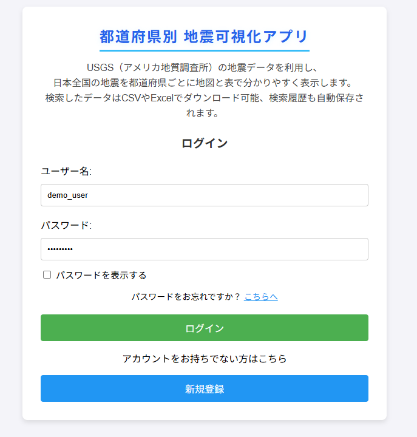
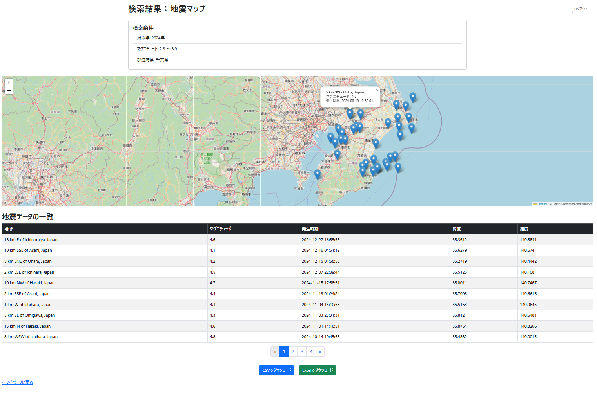

# 都道府県別　地震可視化アプリ


## プロジェクト概要
日本全国・都道府県別の地震データを検索・可視化できるDjango製Webアプリです。  
USGS Earthquake API（アメリカ地質調査所の地震データAPI）を利用し、  
ユーザー登録・検索履歴管理機能も搭載しています。  
マップ表示とCSV/Excel形式でのダウンロードが可能です。


## 特徴
- ユーザー登録 / ログイン / ログアウト
- 地震データを条件（年・地域・マグニチュード値）で検索
- 地図上へのプロット（Leaflet.js）
- 結果一覧のテーブル表示
- ページネーション対応
- CSV / Excelファイルでのデータ出力
- 過去の検索履歴表示・削除
- レスポンシブ対応（スマートフォンでも快適利用）
- USGS Earthquake APIから最新データ取得

## デプロイ先URL
https://quake-viz.onrender.com

## 使用技術
- Python / Django
- HTML / CSS / Bootstrap
- JavaScript / Leaflet.js / SheetJS
- SQLite3（デフォルトDB）
- Render（デプロイ）

## 画面イメージ
### ログイン画面

<br><br>
### 検索フォーム

<br><br>
### 検索結果（地図 + 表）

<br><br>
### マイページ（検索履歴）

<br><br>
## 開発環境
- Python 3.11.2
- Django 5.2
- Bootstrap 5
- requests

## 環境変数の設定
このアプリでは、秘密情報や接続設定を .env ファイルで管理しています。  
プロジェクトルートに .env ファイルを作成し、以下のように記述してください： 

```bash
DEBUG=True  # 本番では必ず False にしてください
SECRET_KEY=your-secret-key-here
ALLOWED_HOSTS=127.0.0.1,localhost
DATABASE_URL=sqlite:///db.sqlite3  # 開発用
```
※ .env ファイルはセキュリティのため Git に含まれていません。  
必要に応じて .env.example を参考にしてください（同梱されています）。


## セットアップ方法
1.リポジトリをクローン
```bash
git clone https://github.com/TechCat-Hello/quake_viz.git
cd quake_viz
```

2.仮想環境を作成・有効化
```bash
python -m venv venv
source venv/bin/activate  # Windowsの場合: venv\Scripts\activate
```

3.依存パッケージをインストール
```bash
pip install -r requirements.txt
```

4.マイグレーション実行
```bash
python manage.py migrate
```

5.開発サーバー起動
```bash
python manage.py runserver
```

6.ブラウザでアクセス  
http://127.0.0.1:8000/ にアクセス  
  
## License
This project is licensed under the MIT License.    
See the [LICENSE](LICENSE) file for details.
  
## Author
- TechCat (GitHub: [TechCat](https://github.com/TechCat-Hello))


